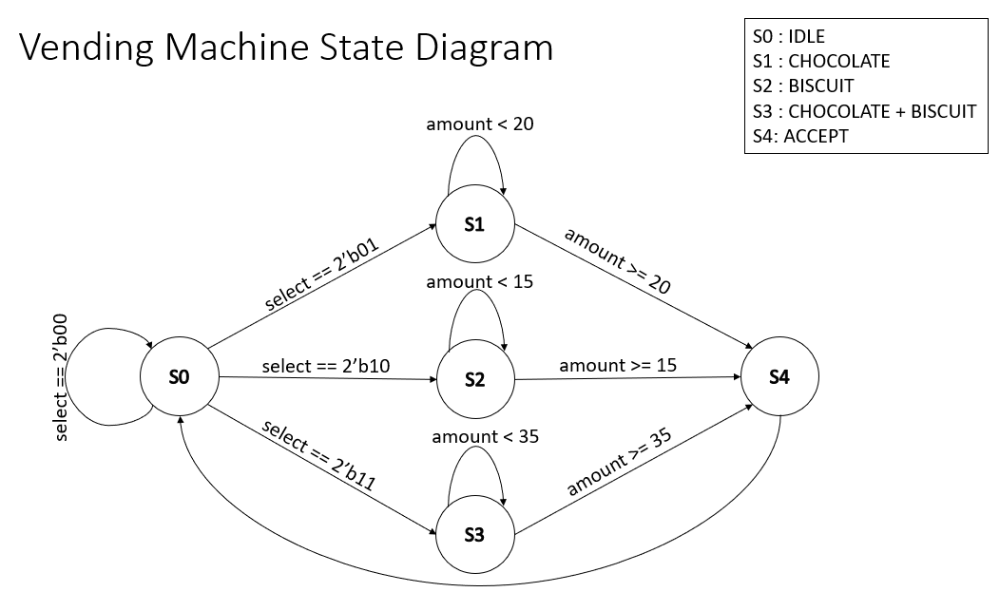
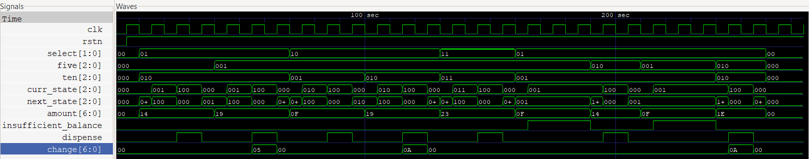

# Vending Machine Controller (Moore FSM)

A Verilog implementation of a **Moore Finite State Machine (FSM)** that simulates a vending machine capable of dispensing products based on user selection and inserted money. The controller validates payments, calculates change, handles insufficient balance conditions, and dispenses the selected product.

---

## Features

- Moore FSM implementation
- Supports multiple product selections
- Validates inserted amount
- Calculates and returns change
- Handles insufficient balance
- One-cycle dispense pulse
- Comprehensive Verilog testbench
- GTKWave waveform verification

---

## Products Supported

| Product | Select | Price |
|---------|:------:|------:|
| Chocolate | `2'b01` | 20 |
| Biscuit | `2'b10` | 15 |
| Chocolate + Biscuit | `2'b11` | 35 |

---

## FSM States

| State | Description |
|--------|-------------|
| IDLE | Waits for product selection |
| CHOCOLATE | Checks payment for Chocolate |
| BISCUIT | Checks payment for Biscuit |
| CHOCO_AND_BISCUIT | Checks payment for both products |
| ACCEPT | Dispenses product and returns change |

---

## Inputs

| Signal | Width | Description |
|--------|:-----:|-------------|
| `clk` | 1 | System clock |
| `rstn` | 1 | Active-low reset |
| `five` | 3 | Number of $5 coins inserted |
| `ten` | 3 | Number of $10 coins inserted |
| `select` | 2 | Product selection |

---

## Outputs

| Signal | Width | Description |
|--------|:-----:|-------------|
| `dispense` | 1 | High for one clock cycle when product is dispensed |
| `insufficient_balance` | 1 | Indicates insufficient payment |
| `change` | 7 | Remaining balance returned after purchase |

---

## State Diagram

<p align="center">

</p>

---

## Simulation Waveform

<p align="center">

</p>

---

## Test Cases

- Chocolate with exact payment
- Chocolate with excess payment
- Biscuit with exact payment
- Biscuit with excess payment
- Chocolate + Biscuit purchase
- Insufficient balance
- Add more money after insufficient balance
- Add more money with change
- Invalid product selection

---

## Project Structure

```
Vending_Machine/
│── vending_machine.v
│── vending_machine_tb.v
│── state_diagram_ven_mac.png
│── waveform_ven_mac.png
└── README.md
```

---

## Future Improvements

- Coin insertion as sequential events instead of counts
- Product stock management
- Coin return/cancel operation
- Multiple product inventory
- Support for additional denominations

---

## Author

**Atharva Vemulapalli**
